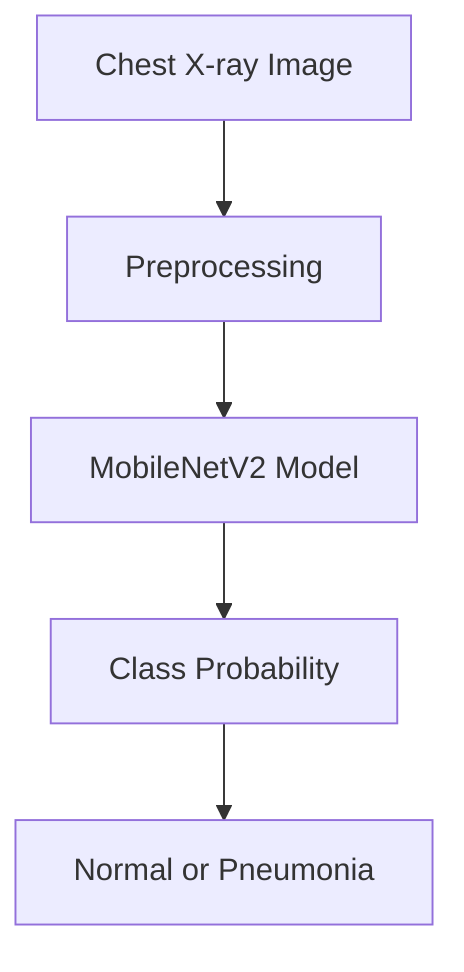

## Live Demo

Try the deployed application here:  
https://huggingface.co/spaces/Madan-S1/pneumonia-detection-system

# Pneumonia Detection System

An AI-powered web application that classifies chest X-ray images as **Normal** or **Pneumonia** using a trained **MobileNetV2 transfer learning** model. The project includes a clean orange-white interface, model inference flow, sample images, and training support for academic and portfolio demonstration.

> Disclaimer: This project is for academic and educational demonstration only. It is not intended for clinical diagnosis or medical decision-making.

## Features

- Classifies chest X-ray images into `NORMAL` and `PNEUMONIA`
- Uses MobileNetV2 transfer learning with TensorFlow/Keras
- Clean web interface built with Python's built-in HTTP server
- Supports image upload and sample image testing
- Displays prediction label, confidence, and class probabilities
- Includes trained model artifacts for direct project demo
- Provides training and evaluation scripts for reproducibility

## Tech Stack

| Area | Technology |
|---|---|
| Programming Language | Python |
| Deep Learning | TensorFlow, Keras |
| Model Architecture | MobileNetV2 |
| Image Processing | Pillow, NumPy |
| Evaluation | scikit-learn, Matplotlib |
| Frontend | HTML, CSS, JavaScript |
| Server | Python `http.server` |

## Project Structure

```text
pneumonia-detection-system/
├── app.py
├── README.md
├── requirements.txt
├── requirements-demo.txt
├── artifacts/
│   ├── model.keras
│   ├── class_names.json
│   └── training_history.png
├── assets/
│   ├── sample_normal.png
│   └── sample_pneumonia.png
├── scripts/
│   └── create_demo_assets.py
├── src/
│   ├── config.py
│   ├── demo_model.py
│   ├── evaluate.py
│   ├── inference.py
│   └── train.py
└── tests/
    └── test_inference.py
```

## Dataset Structure

The dataset is not included in this repository because of its large size. To train the model from scratch, place the dataset in this format:

```text
data/
└── chest_xray/
    ├── train/
    │   ├── NORMAL/
    │   └── PNEUMONIA/
    ├── val/
    │   ├── NORMAL/
    │   └── PNEUMONIA/
    └── test/
        ├── NORMAL/
        └── PNEUMONIA/
```

## How to Run

### 1. Clone the Repository

```bash
git clone https://github.com/Madan-S1/pneumonia-detection-system.git
cd pneumonia-detection-system
```

### 2. Create a Virtual Environment

```bash
python -m venv .venv
```

Activate it on Windows:

```bash
.venv\Scripts\activate
```

Activate it on macOS/Linux:

```bash
source .venv/bin/activate
```

### 3. Install Dependencies

```bash
pip install -r requirements.txt
```

For demo-only usage without training dependencies:

```bash
pip install -r requirements-demo.txt
```

### 4. Run the Application

```bash
python app.py
```

Open the app in your browser:

```text
http://127.0.0.1:8000
```

## Training the Model

If the dataset is available in `data/chest_xray`, train the model using:

```bash
python -m src.train --data-dir data/chest_xray
```

For a quicker test run:

```bash
python -m src.train --data-dir data/chest_xray --epochs 5
```

After training, the model and class labels are saved in:

```text
artifacts/model.keras
artifacts/class_names.json
```

## Model Workflow



## Screenshots

Add screenshots of the application here:

```text
Home UI
Prediction result - Normal
Prediction result - Pneumonia
```

Recommended screenshot folder:

```text
assets/screenshots/
```

## Results

The trained model is saved in the `artifacts/` directory and can be used directly by running the application. The interface displays:

- Predicted class
- Confidence score
- Normal probability
- Pneumonia probability
- Model mode: Demo or Trained

## Important Notes

- The `data/` folder is ignored by Git because the dataset is large.
- The `.venv/` folder is ignored because dependencies can be recreated using `requirements.txt`.
- The trained model file is included because it is small enough for GitHub and useful for direct demonstration.
- This application should not be used as a replacement for medical consultation.

## Author

**Madan S**  
B.Tech CSE - Artificial Intelligence and Machine Learning  
REVA University

